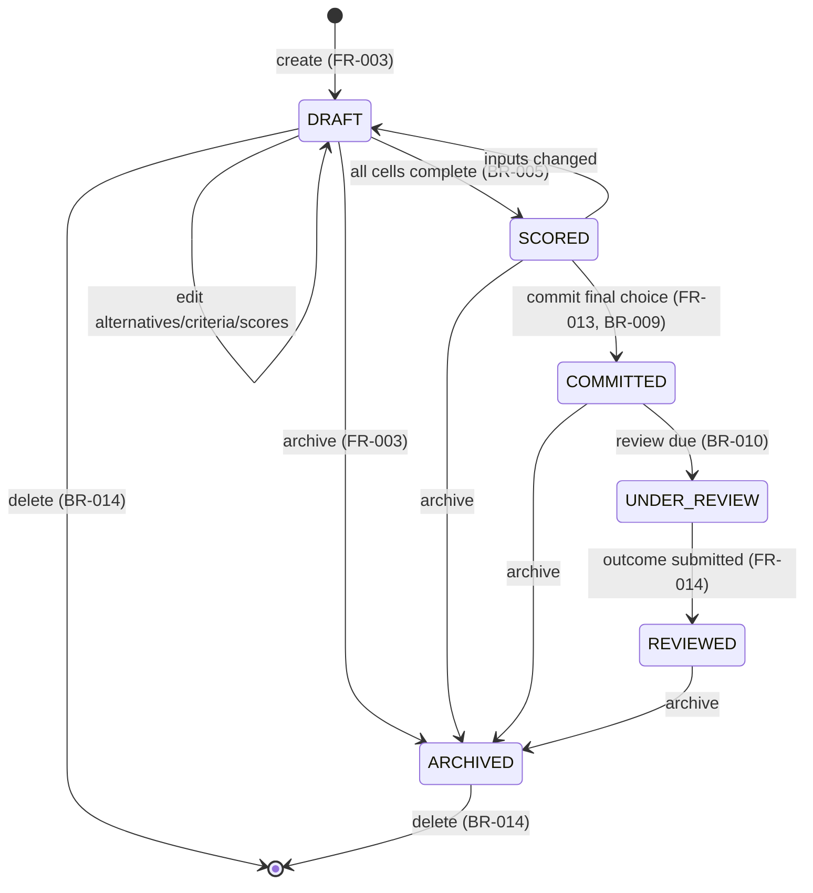
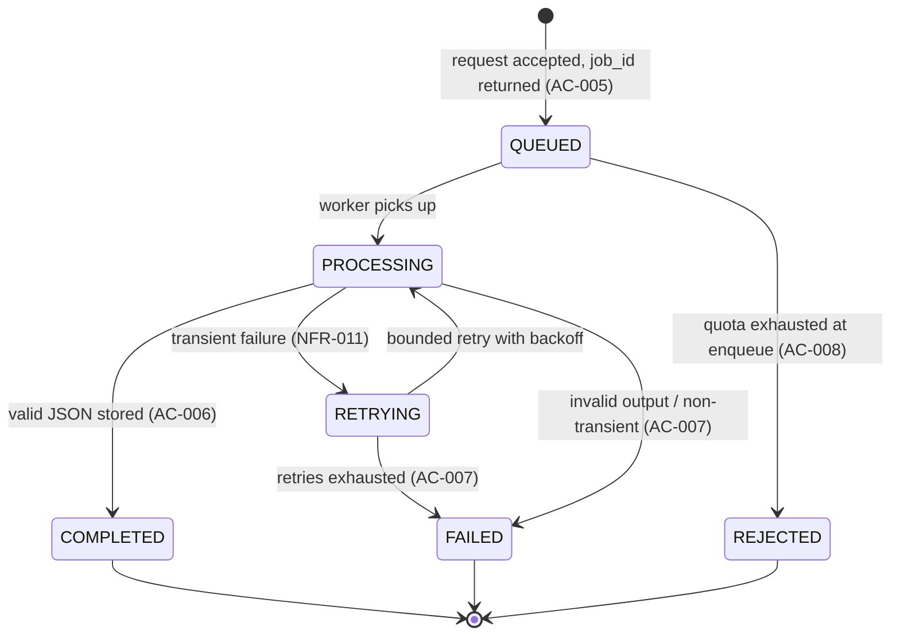

# 02 — Software Requirements Specification (SRS)

**Product:** DecisionForge AI · **Version:** 1.0 · **Date:** 2026-09-23
**Traces to:** BRD v1.0 (FR/NFR/BR/AC/US), DPR v1.0. Additions tagged **[REC]**.

---

## 1. Purpose and Scope

This SRS defines precise, testable system behavior for the DecisionForge AI MVP: actors, use cases, validation rules, state transitions, error conditions, background jobs, notifications, audit, AI, monitoring, and security requirements, plus a Requirement Traceability Matrix (RTM). It is the reference specification cross-cut by the architecture, database, API, and testing documents.

**In scope:** the MVP capabilities of BRD §Scope. **Out of scope:** BRD §Out of scope (payments, mobile apps, collaboration, community, automatic actions, medical/legal/investment advice, voice/video, custom ML).

## 2. System Context

DecisionForge AI is a web application: a React SPA calls a Django REST API; the API persists to PostgreSQL, enqueues asynchronous work to Celery via Redis, and calls Google Gemini only from the backend adapter. Prometheus scrapes the backend and exporters; Grafana visualizes. See `03-system-architecture.md` for diagrams.

## 3. Actors and Permissions

| Actor | Description | Permissions |
|-------|-------------|-------------|
| **Visitor** | Unauthenticated | View landing page; register; sign in. No decision data access. |
| **User** | Authenticated owner | Full CRUD on **own** decisions, alternatives, criteria, scores, analyses, commitments, outcomes; request AI; view own dashboard/calibration. No access to other users' data (BR-008, NFR-002). |
| **System Administrator / Operator** | Ops role | Read system health (Grafana), manage operational configuration and secrets. No routine access to users' private decision content [REC: admin data access policy — see 14/OQ-7]. |
| **Gemini API** | External service | Returns structured advisory analysis on backend request only. |
| **Background Worker** | Celery worker | Processes AI jobs and scheduled reminders; writes results/audit. |

Authorization model: object-level ownership enforced on every nested resource (NFR-002, AC-009). Cross-user access returns 404 or 403 without leaking existence/content (AC-009, see ERR table).

## 4. Use Cases

Each use case lists: actor, preconditions, main flow, alternate/exception flows, postconditions, and the requirements it satisfies.

### UC-01 Register (FR-001, AC-…)
- **Actor:** Visitor. **Pre:** not authenticated.
- **Main:** submit email + password → system validates (VLD-01, VLD-02) → account created → confirmation/authenticated session per auth strategy.
- **Exceptions:** email already in use → ERR-CONFLICT; weak password → ERR-VALIDATION.
- **Post:** User account exists; UserProfile created with defaults [REC].

### UC-02 Authenticate (FR-002)
- **Actor:** Visitor/User. **Main:** login with credentials → tokens issued (access + refresh); logout revokes refresh; refresh rotates access. **Exceptions:** invalid credentials → ERR-AUTH; expired/invalid refresh → ERR-AUTH. **Post:** authenticated session.

### UC-03 Create/Manage Decision (FR-003, BR-001, BR-008)
- **Actor:** User. **Main:** create decision (title, context, category, deadline) → owned by user; view/edit/archive/delete owned decisions. **Exceptions:** access to non-owned → ERR-NOTFOUND (AC-009); delete triggers deletion policy (UC-14, BR-014). **Post:** decision persisted with timestamps/ownership.

### UC-04 Manage Alternatives (FR-004, BR-002)
- **Main:** add/edit/reorder/remove alternatives; a decision needs ≥ 2 alternatives before scoring/ranking (VLD-03, BR-002). **Exceptions:** removing below 2 is allowed while `DRAFT` but blocks ranking (ERR-VALIDATION at ranking, AC-002).

### UC-05 Manage Criteria (FR-005, BR-003, BR-004)
- **Main:** add criteria (name, description, weight > 0, direction ∈ {benefit, cost}); ≥ 1 active criterion required (BR-003). Weights normalized to 100% at calculation (BR-004, VLD-05). **Exceptions:** non-positive weight → ERR-VALIDATION.

### UC-06 Score Matrix (FR-006, BR-005)
- **Main:** enter a score per (alternative × active criterion) with optional rationale. **Exceptions:** score out of range → ERR-VALIDATION (VLD-06). **Post:** cells persisted (upsert).

### UC-07 Calculate Ranking (FR-007, BR-004, BR-005, BR-006, AC-003, AC-004)
- **Pre:** ≥ 2 alternatives (BR-002), ≥ 1 active criterion (BR-003), all cells present (BR-005).
- **Main:** normalize weights; normalize scores by direction; compute weighted totals; return alternatives in descending total, deterministically (AC-003).
- **Exceptions:** < 2 alternatives → ERR-VALIDATION with field guidance (AC-002); missing cells → response enumerates missing (alternative, criterion) pairs (AC-004). **Post:** ranking is a pure function of stored inputs; never altered by AI (BR-006).

### UC-08 Sensitivity Indication (FR-008)
- **Main:** after ranking, indicate whether small weight/score perturbations could change the leader (basic method — see §6/STT and DPR "Basic"). **Post:** advisory indicator; does not change stored data.

### UC-09 Request AI Analysis (FR-009, FR-010, BR-007, BR-012, BR-013, AC-005, AC-006, AC-007)
- **Pre:** decision has scorable content; user within quota (BR-013).
- **Main:** user requests an analysis type → system creates an immutable snapshot (BR-007) → enqueues an `AIAnalysisJob` → returns `job_id` immediately, non-blocking (AC-005) → worker calls Gemini adapter → validates JSON against schema (BR-012) → stores `AIAnalysisResult` against the snapshot (AC-006).
- **Exceptions:** quota exhausted → ERR-QUOTA with actionable message (FR-011, AC-008); invalid output → controlled failure or bounded retry, nothing invalid displayed (AC-007); provider unavailable → fallback (AIR-…). **Post:** job reaches a terminal state; deterministic workflow unaffected (BR-011).

### UC-10 Track AI Job Status (FR-010)
- **Main:** UI polls/subscribes to job state ∈ {QUEUED, PROCESSING, COMPLETED, FAILED}; on COMPLETED shows validated result; on FAILED shows safe message. (See STT-AI.)

### UC-11 Commit Decision (FR-013, BR-006, BR-009, FR-012)
- **Main:** user selects final alternative, records confidence (e.g., 0–100) and rationale → system captures a commitment snapshot (FR-012). Only one **active** commitment per decision; prior commitments remain auditable (BR-009). **Post:** decision status → `COMMITTED`.

### UC-12 Schedule & Submit Outcome Review (FR-014, BR-010, AC-010)
- **Main:** on commit (or later) the user schedules ≥ 1 outcome review with a due date (BR-010). When due, exactly one idempotent reminder job is created (AC-010, UC-15). User submits satisfaction + notes. **Post:** outcome review recorded; feeds calibration.

### UC-13 Dashboard & Calibration (FR-015, FR-016)
- **Main:** list active/completed/pending-review decisions (FR-015); show calibration summary comparing predicted confidence vs recorded satisfaction (FR-016).

### UC-14 Delete Decision / Data (FR-003, BR-014, SEC)
- **Main:** deleting a decision removes or anonymizes dependent private data per the deletion policy (BR-014); account deletion removes/anonymizes user data (DPR §Security). **Post:** no orphaned private content; audit of deletion retained without private payloads.

### UC-15 Background Reminder (FR-014, BR-010, AC-010, NFR-011)
- **Actor:** Worker. **Main:** scheduled scan creates idempotent reminder jobs for due reviews; retries bounded and idempotent (NFR-011).

### UC-16 Export Decision (FR-017, Could)
- **Main:** export one decision as JSON or printable report. **Post:** file contains only owner's data; no secrets.

### UC-17 Expose Metrics (FR-018, NFR-009, BR-015, AC-012)
- **Actor:** Operator/Prometheus. **Main:** backend exposes `/metrics`; scrape yields request/latency/AI/job metrics without private identifiers (BR-015).

## 5. System Behavior (rules that cut across use cases)

- **B-1 Determinism:** ranking output is a pure, reproducible function of `(alternatives, active criteria, weights, scores, directions)`; identical inputs always yield identical order (AC-003, BR-006).
- **B-2 AI isolation:** no AI value is ever written into scores, weights, or ranking (BR-006). AI results are stored separately and labelled advisory in the UI (AI requirements).
- **B-3 Snapshot immutability:** once created, a snapshot's `snapshot_json` is never mutated; new analyses/commitments create new snapshots/versions (BR-007).
- **B-4 Ownership:** every read/write of a nested resource verifies `resource.decision.owner == request.user` (BR-008, NFR-002).
- **B-5 Non-blocking AI:** the request thread never waits for Gemini; all provider calls run in Celery (AC-005, NFR-003).
- **B-6 Fallback-first:** when Gemini is unavailable/over quota/invalid, the system returns a safe fallback and records a metric; the deterministic workflow is unaffected (BR-011, NFR-003).

## 6. Validation Rules

| ID | Rule | Enforced at | Traces to | Error |
|----|------|-------------|-----------|-------|
| VLD-01 | Email is syntactically valid and unique | Register/profile | FR-001 | ERR-VALIDATION / ERR-CONFLICT |
| VLD-02 | Password meets strength policy (length + complexity) | Register/change pw | FR-001, SEC | ERR-VALIDATION |
| VLD-03 | Decision has ≥ 2 alternatives before ranking | Ranking | BR-002, AC-002 | ERR-VALIDATION |
| VLD-04 | Decision has ≥ 1 active criterion before ranking | Ranking | BR-003 | ERR-VALIDATION |
| VLD-05 | Each weight > 0; weights normalizable to 100% | Criteria save / ranking | BR-004 | ERR-VALIDATION |
| VLD-06 | Score within configured range (default 1–10 [REC]) | Score upsert | FR-006 | ERR-VALIDATION |
| VLD-07 | Direction ∈ {benefit, cost} | Criteria save | FR-005 | ERR-VALIDATION |
| VLD-08 | All (alternative × active criterion) cells present before final ranking | Ranking | BR-005, AC-004 | ERR-VALIDATION (lists missing) |
| VLD-09 | Confidence within range (0–100 [REC]) on commit | Commit | FR-013 | ERR-VALIDATION |
| VLD-10 | Outcome satisfaction within defined scale; due date valid | Outcome | FR-014 | ERR-VALIDATION |
| VLD-11 | AI request within per-user quota | AI request | BR-013 | ERR-QUOTA |
| VLD-12 | Gemini response conforms to JSON Schema (types, enums, list sizes, referenced alternative IDs) | Worker | BR-012, AC-007 | recorded failure/retry |
| VLD-13 | Ownership check passes | Every nested op | BR-008, NFR-002 | ERR-NOTFOUND/ERR-FORBIDDEN |
| VLD-14 | Prompt input excludes email/auth/unrelated profile data | AI adapter | NFR-010, AI reqs | blocked before send |

## 7. State Transitions

### 7.1 Decision lifecycle (STT-DEC)

Notes: `COMMITTED` retains prior commitments as audit (BR-009). A decision may cycle `SCORED ⇄ DRAFT` as inputs change; ranking is available whenever preconditions hold.

### 7.2 AI analysis job lifecycle (STT-AI)

## 8. Error Conditions

| ID | Condition | HTTP | User-facing behavior | Traces |
|----|-----------|------|----------------------|--------|
| ERR-VALIDATION | Field/business validation failure | 400 | Field-level guidance (AC-002/AC-004 enumerate specifics) | FR-*, BR-* |
| ERR-AUTH | Missing/invalid/expired credentials or token | 401 | Prompt to re-authenticate | FR-002 |
| ERR-FORBIDDEN | Authenticated but not owner | 403 | Generic denial, no content leak | BR-008, AC-009 |
| ERR-NOTFOUND | Resource absent or not owned | 404 | Generic not-found, no existence leak | AC-009 |
| ERR-CONFLICT | Uniqueness/state conflict (e.g., duplicate email; second active commit) | 409 | Explain conflict | FR-001, BR-009 |
| ERR-QUOTA | Per-user AI quota exhausted / provider 429 | 429 | Actionable message + retry hint; scoring still usable | FR-011, BR-013, AC-008 |
| ERR-AI-INVALID | Gemini output fails schema | (job) FAILED | Nothing invalid shown; safe message | BR-012, AC-007 |
| ERR-AI-UNAVAILABLE | Provider timeout/outage/circuit open | (job) FAILED + fallback | Safe fallback; metric recorded | BR-011, NFR-003 |
| ERR-RATE | App-level rate limit exceeded | 429 | Retry-After guidance | SEC |
| ERR-SERVER | Unexpected error | 500 | Generic message; correlation id logged (no secrets) | SEC |

All errors use the standard envelope in `05-api-specification.md` §Error envelope.

## 9. Background Jobs

| Job | Trigger | Idempotency | Retry | Traces |
|-----|---------|-------------|-------|--------|
| `run_ai_analysis` | AI request (UC-09) | Keyed by snapshot + analysis type + prompt version + model; cache lookup first (AC-011) | Transient only, bounded, exponential backoff + jitter (NFR-011) | FR-009/010, BR-012 |
| `scan_due_reviews` | Beat schedule | One reminder per due review (AC-010) | Bounded | FR-014, BR-010 |
| `send_reminder` | From scan | Dedup by (review_id, due window) | Bounded | FR-014 |
| `generate_summary` | After commit (optional) | Keyed by commitment snapshot | Bounded | DPR AI ops |
| `purge_or_anonymize` | Decision/account deletion (UC-14) | Idempotent by target id | Bounded | BR-014 |

## 10. Notifications

- **In-app:** AI job state changes (FR-010); outcome-review due (FR-014); quota exhaustion (FR-011).
- **Scheduled reminder:** outcome review due (BR-010). Channel is in-app by default; email is [REC] and out of MVP unless confirmed (see 14/OQ-8).
- Notifications never contain secrets or full decision payloads.

## 11. Audit Requirements

- **Immutable snapshots** for each AI run and commitment (BR-007, FR-012).
- **Commitment history** preserved; only one active (BR-009).
- **ActivityEvent** [REC] append-only log of significant actions (create/commit/delete/AI-request/outcome) with actor, action, target type/id, timestamp — excluding secrets and prompt text (aligns with BRD "Operational logs" and data requirements).
- **AIUsageRecord** ledger retains enough to enforce quotas without storing prompt text (BRD data requirements, BR-013).
- Deletion is itself audited without retaining the deleted private payload (BR-014).

## 12. AI-Specific Requirements

| ID | Requirement | Traces |
|----|-------------|--------|
| AIR-01 | Backend uses `GEMINI_API_KEY` and `GEMINI_MODEL` env config; model never hardcoded across the codebase | AI reqs, constraints |
| AIR-02 | Prompts carry a version identifier and use stable templates | AI reqs |
| AIR-03 | Responses request JSON matching an explicit schema; backend validates types, enums, max list sizes, referenced alternative IDs | BR-012, AC-007 |
| AIR-04 | Prompt input excludes email, auth data, unrelated profile data (data minimization) | NFR-010 |
| AIR-05 | Adapter records status, latency, model, prompt version, cache status, token usage when available | AI reqs, OBS |
| AIR-06 | UI distinguishes deterministic calculations from AI advisory content | AI reqs |
| AIR-07 | Provider failure yields a safe, user-readable error and an operational metric | BR-011, NFR-003 |
| AIR-08 | Per-user daily quotas + global circuit breaker | BR-013, DPR safeguards |
| AIR-09 | Cache by hash of normalized input + prompt version + model; identical input returns cache without provider call | AC-011 |
| AIR-10 | Bounded retries with exponential backoff + jitter; transient failures only; HTTP 429 handled with friendly retry time, no continuous loop | NFR-011, DPR safeguards |
| AIR-11 | Advisory disclaimer stored/displayed with results | DPR §Security |

Full design (schemas, prompts, breaker, cache) is in `06-gemini-integration-design.md`.

## 13. Monitoring Requirements

| ID | Requirement | Traces |
|----|-------------|--------|
| OBS-01 | Backend exposes Prometheus-compatible `/metrics` | FR-018 |
| OBS-02 | Measure requests, AI operations, jobs, and DB dependencies | NFR-009 |
| OBS-03 | Metric labels exclude user IDs, decision IDs, prompts, raw URLs, exception messages (low cardinality) | BR-015 |
| OBS-04 | Dashboards: Application, Gemini, Worker, Database, Product (BRD §Monitoring) | Monitoring reqs |
| OBS-05 | Alert conditions per BRD (error rate, P95 latency, AI failure/quota, queue growth, missed reminder, DB connections, disk) | Alert conditions |
| OBS-06 | Health/readiness/liveness endpoints available | DPR, runbook |

Full catalogue in `08-prometheus-grafana-observability.md`.

## 14. Security and Privacy Requirements

| ID | Requirement | Traces |
|----|-------------|--------|
| SEC-01 | Gemini key/backend secrets never in the browser bundle | NFR-001, AC-012 |
| SEC-02 | Object-level ownership on every action; cross-user → 404/403 no leak | NFR-002, BR-008, AC-009 |
| SEC-03 | Secrets only in env vars / secret manager | DPR §Security |
| SEC-04 | HTTPS transport; protect auth tokens | DPR §Security |
| SEC-05 | Input limits, output validation, rate limits, audit logging | DPR §Security |
| SEC-06 | Data minimization to Gemini (no identifiers/email) | NFR-010, AIR-04 |
| SEC-07 | User can delete decisions, analyses, and account | DPR §Security, BR-014 |
| SEC-08 | Logs exclude secrets and minimize personal content | BRD data reqs |
| SEC-09 | Prompt-injection defenses on AI input/output | Security doc |

Full detail in `09-security-and-privacy.md`.

## 15. Requirement Traceability Matrix (RTM)

| BRD ID | Use case(s) | Validation/State/Error | Primary test type (see 10) |
|--------|-------------|------------------------|----------------------------|
| FR-001 | UC-01 | VLD-01, VLD-02 / ERR-VALIDATION, ERR-CONFLICT | API + unit |
| FR-002 | UC-02 | ERR-AUTH | API + security |
| FR-003 | UC-03, UC-14 | STT-DEC / ERR-NOTFOUND | API + unit |
| FR-004 | UC-04 | VLD-03 | API + unit |
| FR-005 | UC-05 | VLD-05, VLD-07 | API + unit |
| FR-006 | UC-06 | VLD-06 | API + unit |
| FR-007 | UC-07 | VLD-03/04/05/08, B-1 / ERR-VALIDATION | unit (engine) + API |
| FR-008 | UC-08 | STT-DEC | unit (sensitivity) |
| FR-009 | UC-09 | AIR-03, VLD-12 | job + adapter + API |
| FR-010 | UC-10 | STT-AI | API + frontend |
| FR-011 | UC-09 | ERR-QUOTA, AC-008 | job + API |
| FR-012 | UC-09, UC-11 | B-3 (snapshots) | unit + API |
| FR-013 | UC-11 | VLD-09, BR-009 | API + unit |
| FR-014 | UC-12, UC-15 | VLD-10, AC-010 | job + API |
| FR-015 | UC-13 | — | API + frontend |
| FR-016 | UC-13 | calibration formula [REC] | unit |
| FR-017 | UC-16 | — | API |
| FR-018 | UC-17 | OBS-01..05 | observability |
| NFR-001 | UC-17, all AI | SEC-01 | security (bundle scan) |
| NFR-002 | all nested | VLD-13, SEC-02 | security (ownership isolation) |
| NFR-003 | UC-09 degraded | B-5, B-6 | integration (Gemini disabled) |
| NFR-004 | all non-AI | — | performance |
| NFR-005/006 | frontend | — | accessibility/responsive |
| NFR-007 | adapter | AIR-01 | unit (adapter interface) |
| NFR-008 | engine + AI | VLD-05/08/12 | unit |
| NFR-009 | UC-17 | OBS-02 | observability |
| NFR-010 | UC-09 | VLD-14, AIR-04 | unit (input builder) |
| NFR-011 | UC-09, UC-15 | AIR-10, STT-AI | job |
| NFR-012 | all | — | devops (compose up) |
| AC-001..AC-012 | UC-03/07/09/12/17 | as mapped above | matched 1:1 in 10-testing |
| BR-001..BR-015 | as mapped | B-1..B-6, VLD-* | unit + API |
| US-001..US-008 | UC-03/05/09/07/09/11/12/17 | — | acceptance |

Every BRD identifier appears at least once above; `14-assumptions-open-questions.md` records the four interpretation gaps referenced as [REC].
