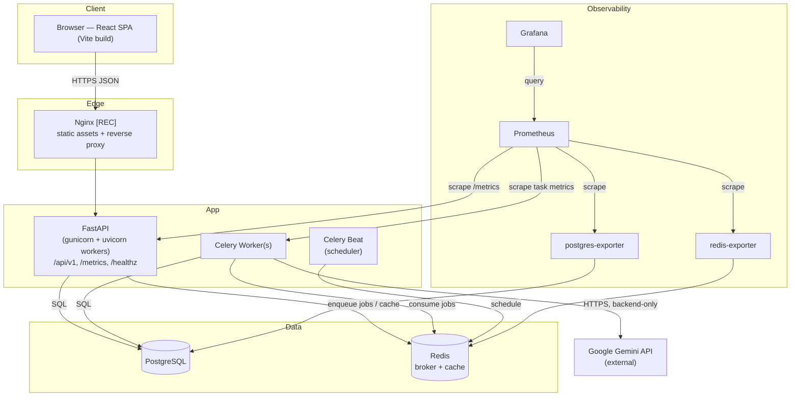
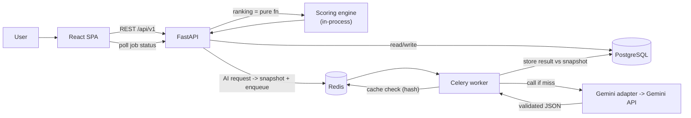
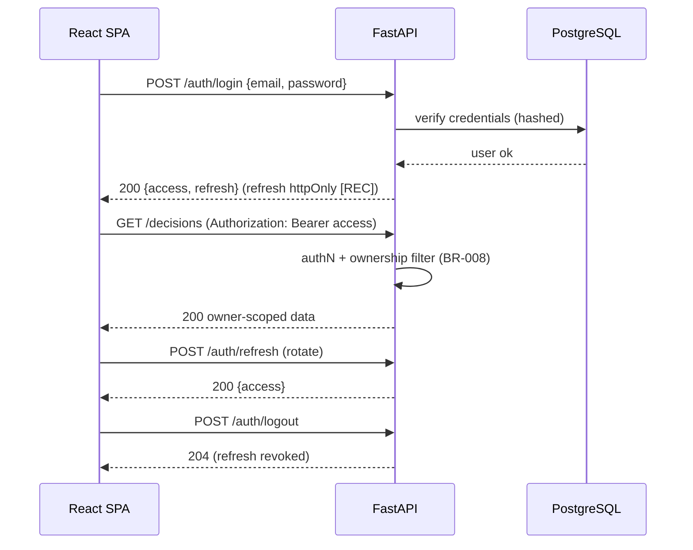
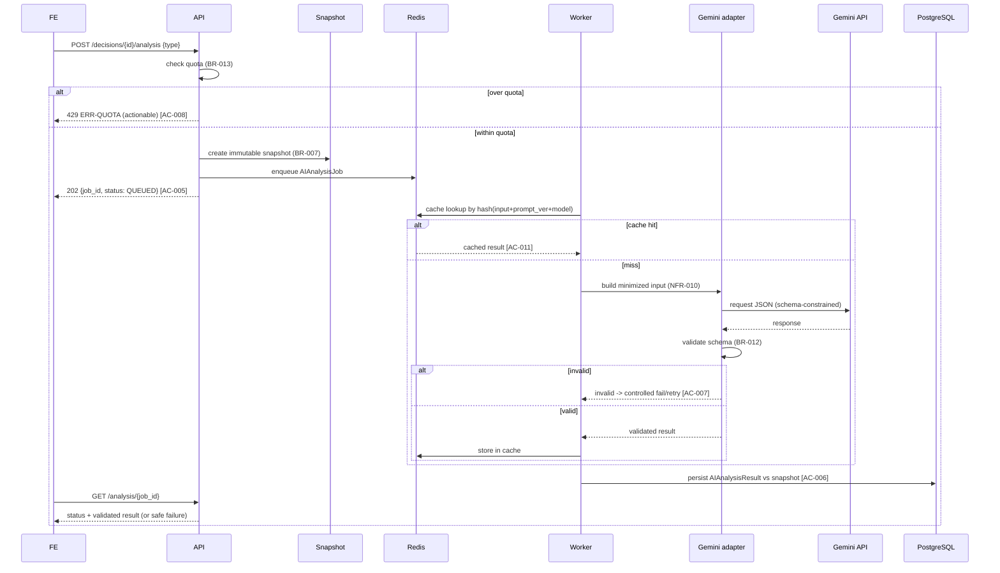
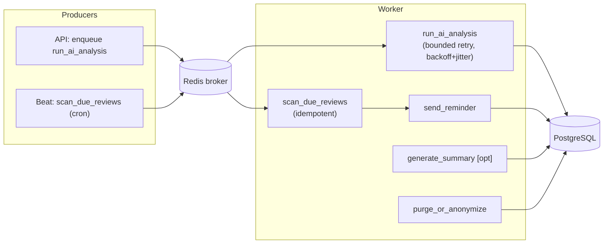
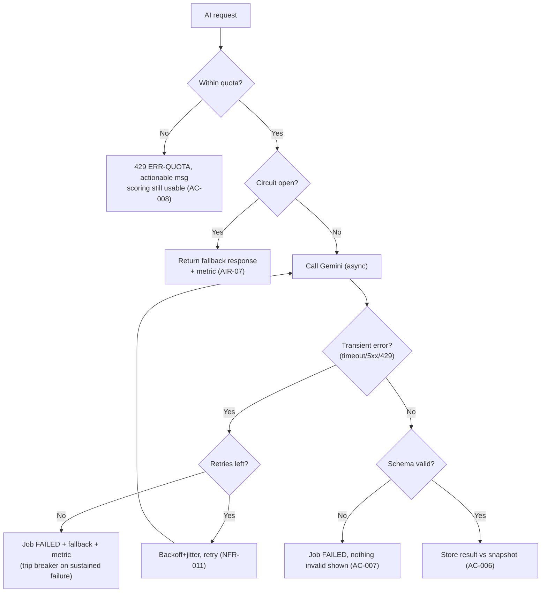

# 03 — System Architecture

**Product:** DecisionForge AI · **Version:** 1.0 · **Date:** 2026-09-23
**Traces to:** DPR v1.0 (architecture authority), BRD v1.0 (constraints). Additions tagged **[REC]**.

---

## 1. Architecture Overview

DecisionForge AI is a containerized web application with a clear separation of concerns (DPR §Recommended technical architecture):

- **Frontend** — React + TypeScript + Vite SPA; decision workspace, charts, forms, responsive UI. Talks only to the backend REST API.
- **Backend** — FastAPI (async SQLAlchemy 2, Pydantic v2); business rules, validation, auth, deterministic scoring engine, REST API, `/metrics`. The **only** component that calls Gemini.
- **Database** — PostgreSQL; users, decisions, alternatives, criteria, scores, snapshots, AI results, outcomes, usage ledger, audit.
- **Async** — Celery workers + Redis (broker/result backend + response cache); AI jobs, reminders, summaries.
- **AI adapter** — Google Gen AI SDK behind a service interface; schemas, retries, cache, model selection, circuit breaker.
- **Observability** — Prometheus scrapes the FastAPI `/metrics`, the Celery worker (`:9808`), and the PostgreSQL/Redis exporters; Grafana dashboards are provisioned from files. See `observability-setup.md`.
- **Runtime** — Docker Compose for consistent local dev (and reference deployment).

**Load-bearing decisions:** deterministic engine is independent of AI (BR-006/011); Gemini is backend-only and env-configured (NFR-001, AIR-01); AI calls are async and non-blocking (AC-005); metrics are low-cardinality (BR-015).

## 2. Container-Level Architecture



Only the **worker and API** reach Gemini; the browser never does (NFR-001). Nginx is [REC] for local single-origin serving and TLS termination; Compose may serve the SPA via Vite preview in pure-dev mode.

## 3. Frontend Architecture

- **Stack:** React, TypeScript, Vite, React Router, TanStack Query (server state/caching), Zustand or Context (local UI state), React Hook Form + Zod (forms/validation), Tailwind (styling), Recharts (charts), Vitest + RTL (tests).
- **Layering:**
  - `routes/` — route components (see `07-frontend-ux-specification.md` route map).
  - `features/` — decision, alternatives, criteria, scoring, ranking, ai, outcomes, dashboard — each with components, hooks, API clients, Zod schemas.
  - `api/` — typed client; single axios/fetch wrapper; injects auth; maps the standard error envelope.
  - `lib/` — formatting, chart helpers, a11y utilities.
  - `store/` — Zustand slices for ephemeral UI (wizard step, modals).
- **Server state via TanStack Query:** queries keyed by resource; mutations invalidate keys; AI job status via polling (interval backs off) or SSE [REC].
- **Type safety:** Zod schemas mirror API contracts (05); the same schemas validate forms and parse responses.

## 4. Backend Module Architecture

Backend modules (bounded contexts: api / schemas / services / repositories / models / domain), all under a versioned API:

| App/module | Responsibility | Key SRS refs |
|------------|----------------|--------------|
| `accounts` | Auth, users, profiles, token lifecycle | FR-001/002, SEC |
| `decisions` | Decision, Alternative, Criterion, AlternativeScore CRUD; ownership | FR-003/004/005/006, BR-001/008 |
| `scoring` | Deterministic normalization, ranking, sensitivity (pure functions, no AI) | FR-007/008, BR-004/005/006 |
| `snapshots` | Immutable snapshot creation + versioning | FR-012, BR-007 |
| `ai` | Adapter interface, prompt templates, schemas, cache, quota, circuit breaker; Celery tasks | FR-009/010/011, BR-012/013, AIR-* |
| `outcomes` | Commitment, outcome reviews, calibration, reminders | FR-013/014/016, BR-009/010 |
| `activity` [REC] | Append-only ActivityEvent audit log | Audit reqs |
| `observability` | Metrics instrumentation, health/readiness | FR-018, OBS-* |
| `common` | Error envelope, pagination, permissions (ownership), base models | NFR-002 |

The **scoring engine is a pure library** with no I/O, so it is trivially unit-tested and can never be affected by AI (BR-006, NFR-008).

## 5. Data Flow



## 6. Authentication Flow



Token storage strategy and CSRF/CORS posture are specified in `09-security-and-privacy.md` (SEC-04; token-storage decision in 14/OQ-3).

## 7. Decision Analysis Flow (deterministic — no AI)

```mermaid
sequenceDiagram
    participant FE
    participant API
    participant ENG as Scoring engine
    FE->>API: GET /decisions/{id}/ranking
    API->>API: load alternatives, active criteria, scores
    API->>API: guard: >=2 alts (BR-002), >=1 crit (BR-003), all cells (BR-005)
    alt preconditions fail
        API-->>FE: 400 ERR-VALIDATION (missing cells / <2 alts) [AC-002, AC-004]
    else ok
        API->>ENG: normalize weights (BR-004) + scores by direction
        ENG->>ENG: weighted totals; stable sort desc (AC-003)
        ENG-->>API: ranked list + basic sensitivity (FR-008)
        API-->>FE: 200 deterministic ranking
    end
```

## 8. Gemini Request Flow (advisory — async, validated)



## 9. Celery Task Flow



Idempotency and retry policy per SRS §9 and NFR-011.

## 10. Metrics Flow

```mermaid
flowchart LR
    API["FastAPI /metrics"] -->|scrape| PR["Prometheus"]
    WK["Celery task metrics"] -->|scrape/pushgateway [REC]| PR
    PGX["postgres-exporter"] --> PR
    RDX["redis-exporter"] --> PR
    PR -->|recording + alert rules| PR
    PR --> GF["Grafana dashboards"]
    PR --> AM["Alertmanager [REC]"]
```

Worker metrics: prefer a worker-embedded HTTP metrics endpoint scraped directly; Pushgateway is [REC] only if workers are not directly scrapeable. Cardinality rules per BR-015 / OBS-03.

## 11. Failure and Fallback Flow



Deterministic workflow is unaffected by any branch above (BR-011, NFR-003).

## 12. Architectural Decisions and Trade-offs (ADRs — condensed)

| ADR | Decision | Rationale | Trade-off / alternative |
|-----|----------|-----------|-------------------------|
| ADR-01 | Deterministic engine as a pure, in-process library separate from AI | Guarantees BR-006/011, easy to test (NFR-008) | None material |
| ADR-02 | Gemini calls only in Celery workers, never in request path | Non-blocking (AC-005), resilient (NFR-003) | Adds async complexity; needs job status UI |
| ADR-03 | Backend-only adapter behind an interface; model via `GEMINI_MODEL` | NFR-001/007, AIR-01; survive model changes | Slight indirection |
| ADR-04 | Cache AI results by `hash(input+prompt_version+model)` in Redis | AC-011, cost control | Cache invalidation on prompt/model change (handled by keying) |
| ADR-05 | Snapshots immutable + versioned | BR-007 auditability, comparison | Extra storage (JSONB) |
| ADR-06 | JWT access + rotating refresh | Stateless API, SPA-friendly | Token storage risk → see SEC/OQ-3 |
| ADR-07 | Prometheus pull + exporters | BRD mandate, standard | Worker scrape setup |
| ADR-08 | Normalized relational core + JSONB for snapshot/AI payloads | Integrity for core, flexibility for evolving AI schemas | JSONB less queryable (acceptable; payloads are read-whole) |
| ADR-09 | Global circuit breaker + per-user quota | DPR safeguards, BR-013 | Breaker state store (Redis) |

## 13. Scaling Approach

- **Stateless API** → scale horizontally behind Nginx; sessions carried by JWT.
- **Workers** → scale by queue depth (OBS metric); separate queues for AI vs reminders [REC] to isolate latency.
- **PostgreSQL** → vertical first; add read replica later for dashboard/calibration reads [REC, post-MVP].
- **Redis** → single instance for MVP; cache eviction policy sized to AI cache TTL.
- **Gemini** → capacity governed by per-user quota + global breaker, not by scaling infra.
- MVP target is the local reference environment (NFR-004); the above is the growth path, not MVP work.

## 14. Deployment Topology

- **MVP / portfolio:** single-host Docker Compose with services: `web` (API), `worker`, `db`, `redis`, `prometheus`, `grafana`, `postgres-exporter`, `redis-exporter`, and `frontend` (dev). A `beat` scheduler and `nginx` are not deployed yet: no periodic tasks exist. See `11-devops-deployment-runbook.md`.
- **Production hardening path [REC]:** managed Postgres, TLS at the edge, secrets manager, separate worker autoscaling, Alertmanager. Detailed in the runbook's production-hardening checklist. Not required for MVP acceptance.
