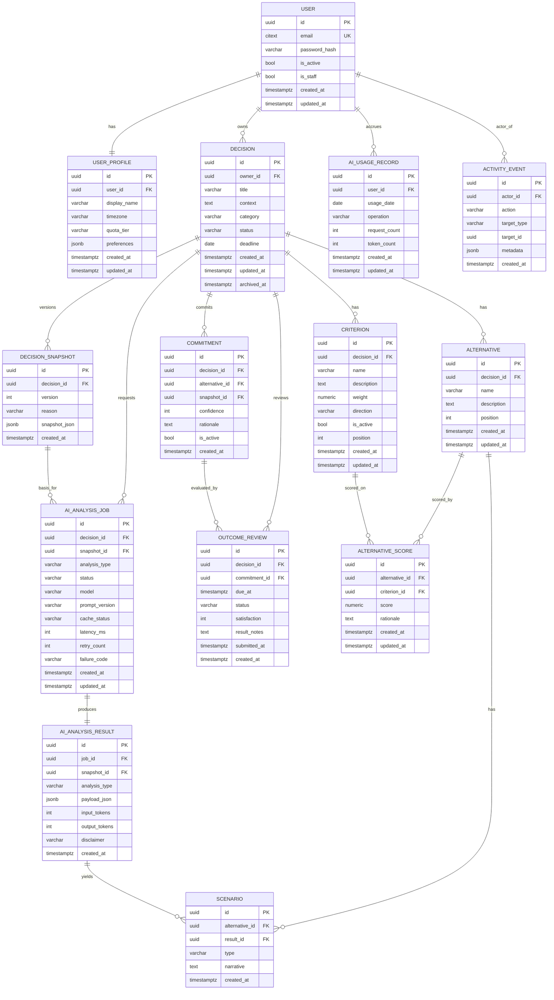

# 04 — Database Design

**Product:** DecisionForge AI · **Version:** 1.0 · **Date:** 2026-09-23
**DB:** PostgreSQL · **ORM:** Django. Traces to DPR §Domain model, BRD §Data requirements. Additions tagged **[REC]**.

---

## 1. Naming Reconciliation (canonical entity names)

The task's entity list differs from the source domain model. Canonical names used here, with source synonyms:

| Canonical (this package) | BRD/DPR synonym | Notes |
|--------------------------|-----------------|-------|
| `Alternative` | Option | Candidate choice |
| `AlternativeScore` | OptionScore | Cell in the matrix |
| `AIAnalysisJob` | AnalysisRun | Async job record |
| `AIAnalysisResult` | AIInsight | Validated Gemini output |
| `AIUsageRecord` | UsageLedger | Quota ledger |
| `UserProfile` | (User fields: name, timezone) | Split out [REC] |
| `Scenario` | (AI "scenarios" output) | First-class persistence [REC] |
| `ActivityEvent` | ("Operational logs"/audit) | Append-only audit [REC] |
| `DecisionSnapshot` | DecisionSnapshot | Immutable version |
| `OutcomeReview` | OutcomeReview | Follow-up |

## 2. Complete Entity List

1. `User` — auth identity (email, password hash, flags, timestamps).
2. `UserProfile` [REC] — display name, timezone, preferences, quota tier.
3. `Decision` — aggregate root (owner, title, context, category, status, deadline).
4. `Alternative` — candidate choice under a decision.
5. `Criterion` — weighted evaluation dimension (direction benefit/cost).
6. `AlternativeScore` — score for (alternative × criterion) with rationale.
7. `Scenario` [REC] — persisted best/likely/worst narrative per alternative.
8. `DecisionSnapshot` — immutable versioned inputs at AI run / commitment.
9. `AIAnalysisJob` — async Gemini request (status, model, prompt version, latency).
10. `AIAnalysisResult` — validated structured payload + provider metadata.
11. `Commitment` — final choice, confidence, rationale (supports history).
12. `OutcomeReview` — scheduled + submitted outcome (satisfaction, notes).
13. `ActivityEvent` [REC] — append-only audit of significant actions.
14. `AIUsageRecord` — quota ledger (counts/tokens, no prompt text).

`Commitment` is modelled explicitly (rather than fields on `Decision`) to satisfy BR-009 "prior commitments remain auditable" with one active commitment.

## 3. ER Diagram (Mermaid)

## 4. Tables, Columns, Types, Keys, Constraints

Conventions: PK = `uuid` (`gen_random_uuid()` / `default=uuid4`); all tables carry `created_at timestamptz not null default now()`; mutable tables add `updated_at`. `citext` for email (case-insensitive). `numeric` for weights/scores to avoid float drift in the deterministic engine.

### 4.1 `user`
| Column | Type | Constraints |
|--------|------|-------------|
| id | uuid | PK |
| email | citext | **UNIQUE**, NOT NULL, format-validated |
| password_hash | varchar(255) | NOT NULL (Django PBKDF2/Argon2) |
| is_active | boolean | NOT NULL default true |
| is_staff | boolean | NOT NULL default false |
| created_at / updated_at | timestamptz | NOT NULL |

Django note: extend `AbstractBaseUser` with email as `USERNAME_FIELD`.

### 4.2 `user_profile` [REC]
| Column | Type | Constraints |
|--------|------|-------------|
| id | uuid | PK |
| user_id | uuid | FK→user.id, **UNIQUE**, ON DELETE CASCADE |
| display_name | varchar(120) | NULL |
| timezone | varchar(64) | NOT NULL default 'UTC' |
| quota_tier | varchar(32) | NOT NULL default 'free' |
| preferences | jsonb | NOT NULL default '{}' |

### 4.3 `decision`
| Column | Type | Constraints |
|--------|------|-------------|
| id | uuid | PK |
| owner_id | uuid | FK→user.id, NOT NULL, ON DELETE CASCADE |
| title | varchar(200) | NOT NULL |
| context | text | NULL |
| category | varchar(64) | NULL |
| status | varchar(16) | NOT NULL default 'DRAFT'; **CHECK** in ('DRAFT','SCORED','COMMITTED','UNDER_REVIEW','REVIEWED','ARCHIVED') |
| deadline | date | NULL |
| archived_at | timestamptz | NULL |

### 4.4 `alternative`
| Column | Type | Constraints |
|--------|------|-------------|
| id | uuid | PK |
| decision_id | uuid | FK→decision.id, NOT NULL, ON DELETE CASCADE |
| name | varchar(200) | NOT NULL |
| description | text | NULL |
| position | int | NOT NULL default 0 |
UNIQUE (decision_id, name) [REC]; index (decision_id, position).

### 4.5 `criterion`
| Column | Type | Constraints |
|--------|------|-------------|
| id | uuid | PK |
| decision_id | uuid | FK→decision.id, NOT NULL, ON DELETE CASCADE |
| name | varchar(200) | NOT NULL |
| description | text | NULL |
| weight | numeric(6,3) | NOT NULL; **CHECK weight > 0** (BR-004) |
| direction | varchar(8) | NOT NULL; **CHECK** in ('benefit','cost') |
| is_active | boolean | NOT NULL default true |
| position | int | NOT NULL default 0 |
UNIQUE (decision_id, name) [REC].

### 4.6 `alternative_score`
| Column | Type | Constraints |
|--------|------|-------------|
| id | uuid | PK |
| alternative_id | uuid | FK→alternative.id, NOT NULL, ON DELETE CASCADE |
| criterion_id | uuid | FK→criterion.id, NOT NULL, ON DELETE CASCADE |
| score | numeric(6,3) | NOT NULL; **CHECK** within configured range (default 1–10) [REC] |
| rationale | text | NULL |
**UNIQUE (alternative_id, criterion_id)** — one cell per pair (supports upsert, BR-005).

### 4.7 `scenario` [REC]
| Column | Type | Constraints |
|--------|------|-------------|
| id | uuid | PK |
| alternative_id | uuid | FK→alternative.id, ON DELETE CASCADE |
| result_id | uuid | FK→ai_analysis_result.id, NULL, ON DELETE SET NULL |
| type | varchar(8) | **CHECK** in ('best','likely','worst') |
| narrative | text | NOT NULL |

### 4.8 `decision_snapshot`
| Column | Type | Constraints |
|--------|------|-------------|
| id | uuid | PK |
| decision_id | uuid | FK→decision.id, NOT NULL, ON DELETE CASCADE |
| version | int | NOT NULL |
| reason | varchar(16) | **CHECK** in ('analysis','commitment') |
| snapshot_json | jsonb | NOT NULL (immutable copy of inputs) |
**UNIQUE (decision_id, version)**. Application-enforced immutability (no UPDATE) (BR-007).

### 4.9 `ai_analysis_job`
| Column | Type | Constraints |
|--------|------|-------------|
| id | uuid | PK |
| decision_id | uuid | FK→decision.id, NOT NULL, ON DELETE CASCADE |
| snapshot_id | uuid | FK→decision_snapshot.id, NOT NULL, ON DELETE CASCADE |
| analysis_type | varchar(24) | **CHECK** in ('clarify','assumptions','risks','scenarios','devils_advocate','summary') |
| status | varchar(12) | **CHECK** in ('QUEUED','PROCESSING','RETRYING','COMPLETED','FAILED','REJECTED') |
| model | varchar(64) | NULL |
| prompt_version | varchar(32) | NOT NULL |
| cache_status | varchar(8) | **CHECK** in ('hit','miss') NULL |
| latency_ms | int | NULL |
| retry_count | int | NOT NULL default 0 |
| failure_code | varchar(32) | NULL |
Index (decision_id, created_at); index (status).

### 4.10 `ai_analysis_result`
| Column | Type | Constraints |
|--------|------|-------------|
| id | uuid | PK |
| job_id | uuid | FK→ai_analysis_job.id, **UNIQUE**, ON DELETE CASCADE |
| snapshot_id | uuid | FK→decision_snapshot.id, NOT NULL, ON DELETE CASCADE |
| analysis_type | varchar(24) | mirrors job |
| payload_json | jsonb | NOT NULL (validated structured output) |
| input_tokens / output_tokens | int | NULL (when provider reports) |
| disclaimer | varchar(255) | NOT NULL |
Never stores secrets or prompt text beyond the validated payload (BRD data reqs).

### 4.11 `commitment`
| Column | Type | Constraints |
|--------|------|-------------|
| id | uuid | PK |
| decision_id | uuid | FK→decision.id, NOT NULL, ON DELETE CASCADE |
| alternative_id | uuid | FK→alternative.id, NOT NULL, ON DELETE RESTRICT |
| snapshot_id | uuid | FK→decision_snapshot.id, NOT NULL |
| confidence | int | **CHECK** 0..100 [REC] |
| rationale | text | NULL |
| is_active | boolean | NOT NULL default true |
**Partial UNIQUE**: `UNIQUE (decision_id) WHERE is_active` — enforces one active commitment (BR-009) while keeping history.

### 4.12 `outcome_review`
| Column | Type | Constraints |
|--------|------|-------------|
| id | uuid | PK |
| decision_id | uuid | FK→decision.id, NOT NULL, ON DELETE CASCADE |
| commitment_id | uuid | FK→commitment.id, ON DELETE CASCADE |
| due_at | timestamptz | NOT NULL |
| status | varchar(12) | **CHECK** in ('SCHEDULED','DUE','SUBMITTED','CANCELLED') |
| satisfaction | int | **CHECK** within scale (e.g., 1..5) NULL until submitted |
| result_notes | text | NULL |
| submitted_at | timestamptz | NULL |
Index (status, due_at) for the reminder scan.

### 4.13 `activity_event` [REC]
| Column | Type | Constraints |
|--------|------|-------------|
| id | uuid | PK |
| actor_id | uuid | FK→user.id, ON DELETE SET NULL |
| action | varchar(48) | NOT NULL (e.g., 'decision.create','decision.commit','ai.request','decision.delete') |
| target_type | varchar(32) | NOT NULL |
| target_id | uuid | NULL |
| metadata | jsonb | NOT NULL default '{}' (no secrets/prompt text) |
Append-only (no UPDATE/DELETE in app). Index (actor_id, created_at); index (target_type, target_id).

### 4.14 `ai_usage_record`
| Column | Type | Constraints |
|--------|------|-------------|
| id | uuid | PK |
| user_id | uuid | FK→user.id, NOT NULL, ON DELETE CASCADE |
| usage_date | date | NOT NULL |
| operation | varchar(24) | NOT NULL |
| request_count | int | NOT NULL default 0 |
| token_count | int | NOT NULL default 0 |
**UNIQUE (user_id, usage_date, operation)** — daily quota accounting (BR-013); no prompt text (data reqs).

## 5. Indexes (summary)

| Table | Index | Reason |
|-------|-------|--------|
| decision | (owner_id, status) | Dashboard lists (FR-015) |
| decision | (owner_id, updated_at desc) | Recent decisions |
| alternative | (decision_id, position) | Ordered display (FR-004) |
| criterion | (decision_id, is_active) | Active-criteria queries (BR-003) |
| alternative_score | UNIQUE (alternative_id, criterion_id) | Cell integrity + upsert (BR-005) |
| decision_snapshot | UNIQUE (decision_id, version) | Versioning (BR-007) |
| ai_analysis_job | (decision_id, created_at), (status) | Status polling, worker scans |
| commitment | partial UNIQUE (decision_id) WHERE is_active | One active commit (BR-009) |
| outcome_review | (status, due_at) | Reminder scan (AC-010) |
| ai_usage_record | UNIQUE (user_id, usage_date, operation) | Quota (BR-013) |
| activity_event | (target_type, target_id), (actor_id, created_at) | Audit lookups |

## 6. Deletion Behavior (BR-014, SEC-07)

- **Decision delete:** cascade to alternatives, criteria, scores, snapshots, jobs, results, scenarios, commitments, outcome reviews (all `ON DELETE CASCADE`). An `activity_event` records the deletion with **no** private payload.
- **Account delete:** cascade user-owned decisions and profile; `activity_event.actor_id` set NULL to preserve audit shape without identity; `ai_usage_record` cascades.
- **Anonymization option [REC]:** where retention of aggregate stats is desired, decisions may be anonymized instead of hard-deleted (owner set to a tombstone, private text nulled). The active policy (delete vs anonymize) is an open question — see 14/OQ-4.
- `commitment.alternative_id` is `ON DELETE RESTRICT` so a referenced alternative cannot be deleted out from under an active commitment; the app blocks with ERR-CONFLICT.

## 7. Audit Fields

Every table has `created_at`; mutable tables have `updated_at` (maintained by a Django base model / `auto_now`). Immutable tables (`decision_snapshot`, `ai_analysis_result`, `activity_event`, `scenario`) omit `updated_at` by design. Snapshots and results are never updated after insert (BR-007).

## 8. JSONB Usage and Justification

| Column | Why JSONB (not columns) |
|--------|--------------------------|
| `decision_snapshot.snapshot_json` | Captures the full input set at a point in time; shape must not be coupled to evolving relational schema; read whole for comparison/audit (BR-007). |
| `ai_analysis_result.payload_json` | Gemini output schema differs per analysis type and may evolve with prompt versions; stored as validated whole; not queried field-by-field. |
| `user_profile.preferences`, `activity_event.metadata` | Sparse, evolving key/values; no relational queries needed. |

Core decision data (alternatives, criteria, scores, commitments) stays **relational** for integrity, constraints, and the deterministic engine — JSONB is used only where the payload is read as a unit and its schema is intentionally flexible.

## 9. Suggested Django Model Relationships

- `User` (custom) `1—1` `UserProfile` (OneToOne, `related_name='profile'`).
- `User` `1—N` `Decision` (`owner`, `related_name='decisions'`).
- `Decision` `1—N` `Alternative`, `Criterion`, `DecisionSnapshot`, `AIAnalysisJob`, `Commitment`, `OutcomeReview`.
- `Alternative` `1—N` `AlternativeScore` (`related_name='scores'`); `Criterion` `1—N` `AlternativeScore`.
- `AlternativeScore` `unique_together = (alternative, criterion)`.
- `Alternative` `1—N` `Scenario`; `AIAnalysisResult` `1—N` `Scenario` (nullable).
- `DecisionSnapshot` `1—N` `AIAnalysisJob`; `AIAnalysisJob` `1—1` `AIAnalysisResult`.
- `Commitment` partial-unique active per decision via `UniqueConstraint(fields=['decision'], condition=Q(is_active=True), name='one_active_commit')`.
- `AIUsageRecord` `UniqueConstraint(fields=['user','usage_date','operation'])`.
- Use a `TimeStampedModel` abstract base for `created_at/updated_at`.

## 10. Initial Migration Strategy

1. `accounts` first (custom `User` **before any `makemigrations`**; set `AUTH_USER_MODEL` in settings from commit #1 — changing it later is costly).
2. `decisions` (Decision, Alternative, Criterion, AlternativeScore) with constraints/indexes.
3. `snapshots`, then `ai` (jobs/results/scenarios/usage), then `outcomes` (commitment/outcome), then `activity`.
4. One migration per app per feature slice; never edit an applied migration — add a new one.
5. Enable `pgcrypto`/`gen_random_uuid` (or rely on Python `uuid4`) in an initial migration.
6. CI runs `manage.py makemigrations --check --dry-run` to fail on model/migration drift.

## 11. Seed-Data Strategy

- **Idempotent seed** via a management command `seed_demo` (safe to re-run): one demo user, one fully-scored sample decision (e.g., "Job offer A vs B vs C") with 3 alternatives, 4 criteria, complete scores, and one completed **mock** AI result (no live Gemini call) so the UI and dashboards have data offline.
- Seeds must contain **no secrets** and no real API keys.
- Grafana/Prometheus provisioning is separate (see 08/11), not DB seed.

## 12. Data Retention Considerations (BRD §Data requirements)

| Data | Retention |
|------|-----------|
| Decision data | Until user deletion; timestamps + ownership preserved |
| Snapshots | Immutable; retained with their decision |
| AI results | Validated payload + provider metadata; never secrets |
| Usage ledger | Enough to enforce quotas; **no prompt text**; may aggregate/rotate old rows [REC] |
| Outcome reviews | Preserved for calibration history |
| Activity events | Append-only; may be partitioned/rotated by age [REC] |
| Operational logs | Exclude secrets; minimize personal content |
| Metrics | Aggregate, low-cardinality labels only (BR-015) |

Retention windows for usage/activity/logs beyond MVP are an open question (see 14/OQ-9).
