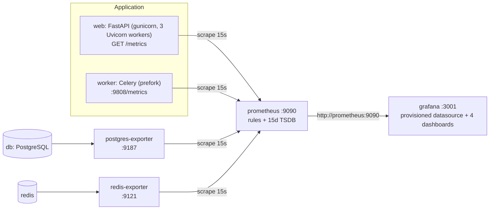

# Observability Setup

Monitoring for DecisionForge AI: Prometheus metrics from the FastAPI backend and the Celery worker,
PostgreSQL and Redis exporters, Prometheus recording and alert rules, and four provisioned Grafana
dashboards. Everything runs under the existing Docker Compose file.

## 1. Architecture and data flow



- **Pull model.** Prometheus scrapes every target by Docker service name (`web:8000`,
  `worker:9808`, `postgres-exporter:9187`, `redis-exporter:9121`, `prometheus:9090`), never
  `localhost`.
- **Multiprocess mode.** Gunicorn runs 3 workers and Celery runs prefork children, so both use
  `prometheus_client` multiprocess mode. `entrypoint.sh` sets `PROMETHEUS_MULTIPROC_DIR` and wipes
  it on start; `gunicorn.conf.py` marks dead workers; `/metrics` aggregates every process's files,
  so counters are exact (verified: 1 created decision reads as exactly `1.0` across 3 workers).
- **Worker metrics.** Celery tasks run in a different container from the API, so their counters
  cannot appear on the API's `/metrics`. The worker serves its own endpoint on `:9808`
  (`CELERY_METRICS_PORT`) once `worker_ready` fires.
- **Exporters are internal.** Neither exporter publishes a host port. Only Prometheus (`9090`),
  Grafana (`3001`) and the API (`8000`) are published, for local development.

Why a custom ASGI middleware instead of `prometheus-fastapi-instrumentator`: the middleware
(`app/observability/http_metrics.py`) already provides everything required (route-template labels,
`/metrics` excluded, in-progress gauge in `livesum` mode, response sizes) and works with
multiprocess mode. Adding the instrumentator would register a second, overlapping set of HTTP
series.

## 2. Directory layout

```text
backend/app/observability/
  metrics.py           business metric definitions + bounded-label helpers
  http_metrics.py      HTTP middleware (decisionforge_http_*)
  instrumentation.py   AI-call / AI-job / cache wrappers, Celery signal handlers, worker server
  health.py            /health, /ready (+ /healthz, /readyz aliases)
backend/scripts/check_dashboards.py   runs every dashboard query against a live Prometheus
infrastructure/
  prometheus/prometheus.yml           scrape config (15s scrape + evaluation)
  prometheus/recording-rules.yml      20 recording rules (decisionforge:*)
  prometheus/alerts.yml               16 alert rules
  grafana/provisioning/datasources/prometheus.yml   uid decisionforge-prometheus
  grafana/provisioning/dashboards/dashboards.yml    file provider -> /var/lib/grafana/dashboards
  grafana/dashboards/decisionforge-{overview,api,ai,infrastructure}.json
```

## 3. Dependencies

| Component | Version | Where |
|-----------|---------|-------|
| `prometheus-client` | see `backend/requirements/base.txt` | backend + worker |
| Prometheus | `prom/prometheus:v2.54.1` | Compose `prometheus` |
| Grafana | `grafana/grafana:11.2.0` | Compose `grafana` |
| PostgreSQL exporter | `quay.io/prometheuscommunity/postgres-exporter:v0.15.0` | Compose `postgres-exporter` |
| Redis exporter | `oliver006/redis_exporter:v1.63.0-alpine` (alpine variant ships `wget` for the health check) | Compose `redis-exporter` |

## 4. Environment variables

| Variable | Default | Purpose |
|----------|---------|---------|
| `ENABLE_METRICS` | `true` | Mounts `/metrics` and the HTTP middleware. `PROMETHEUS_METRICS_ENABLED` is still honoured as a legacy alias. |
| `CELERY_METRICS_PORT` | `9808` | Worker metrics port. |
| `GRAFANA_ADMIN_USER` | `admin` | Grafana admin login (`GF_SECURITY_ADMIN_USER` accepted as fallback). |
| `GRAFANA_ADMIN_PASSWORD` | `change-me` | **Change it.** Grafana admin password (`GF_SECURITY_ADMIN_PASSWORD` fallback). |
| `POSTGRES_USER` / `POSTGRES_PASSWORD` / `POSTGRES_DB` | from `.env` | Reused by `postgres-exporter` via `DATA_SOURCE_USER`/`DATA_SOURCE_PASS`/`DATA_SOURCE_URI` (credentials are not embedded in a URL, so special characters need no encoding). |
| `REDIS_PASSWORD` | empty | Only if you enable Redis AUTH; passed to `redis-exporter`. |

## 5. Local startup

```bash
cp .env.example .env          # then set POSTGRES_PASSWORD, JWT_SECRET_KEY, GRAFANA_ADMIN_PASSWORD
docker compose up -d --build
docker compose ps             # every service should be (healthy); worker has no health check
```

| What | URL |
|------|-----|
| Liveness | http://localhost:8000/health |
| Readiness | http://localhost:8000/ready |
| API metrics | http://localhost:8000/metrics |
| Prometheus | http://localhost:9090 (targets: http://localhost:9090/targets) |
| Grafana | http://localhost:3001 (health: http://localhost:3001/api/health) |

Grafana login: `GRAFANA_ADMIN_USER` / `GRAFANA_ADMIN_PASSWORD` from `.env`. Public sign-up is
disabled. The admin password is only applied when the `grafana_data` volume is first created;
to change it later use `docker compose exec grafana grafana cli admin reset-admin-password <new>`.

**Windows / Git Bash:** `backend/entrypoint.sh` must have LF line endings or the `web` container
exits with `set: Illegal option -`. `.gitattributes` enforces this for fresh checkouts; for an
existing checkout run `git add --renormalize . && git checkout -- backend/entrypoint.sh`.

### Verify targets

```bash
make prometheus-targets       # raw JSON
make verify-observability     # promtool + compose config + every dashboard query + all targets up
```

## 6. Health and readiness

| Endpoint | Checks | Status codes |
|----------|--------|--------------|
| `/health` (`/healthz`) | Process liveness only | always 200 while the process serves requests |
| `/ready` (`/readyz`) | PostgreSQL `SELECT 1` and Redis `PING`, each bounded to 2 s, run concurrently | 200 when both pass, 503 otherwise |

`/ready` body: `{"status","checks":{"database":bool,"redis":bool},"optional":{"gemini":"disabled|configured|misconfigured"}}`.
Gemini is informational only and never affects readiness: the deterministic features work
without it. No connection strings, hosts, credentials or exception text are ever returned.

## 7. Metric catalogue

### HTTP (API process)

| Metric | Type | Labels |
|--------|------|--------|
| `decisionforge_http_requests_total` | counter | `method`, `route`, `status` |
| `decisionforge_http_request_duration_seconds` | histogram | `method`, `route` |
| `decisionforge_http_response_size_bytes` | histogram | `route` |
| `decisionforge_http_requests_in_progress` | gauge (livesum) | none |

`route` is the matched FastAPI route template (`/api/v1/decisions/{decision_id}`), or `unmatched`.
`/metrics` never measures itself. `method` outside the standard set becomes `OTHER`.

### Business and platform metrics

| Metric | Labels | Recorded by | Live today? |
|--------|--------|-------------|-------------|
| `decisionforge_decisions_created_total` | none | `decision_service.create_decision` | **Yes** |
| `decisionforge_ranking_calculations_total` | `status`: success / rejected / failure | `metrics.ranking_timer` in `GET /decisions/{id}/ranking` | **Yes** (`rejected` = unrankable input, a 4xx; not a system failure) |
| `decisionforge_ranking_duration_seconds` | none | same | **Yes** |
| `decisionforge_sensitivity_analyses_total` | `status` | ranking endpoint (sensitivity runs inside every ranking) | **Yes** |
| `decisionforge_celery_tasks_total` | `task_name`, `status`: success / failure / retry | Celery signals | **Yes** (worker endpoint) |
| `decisionforge_celery_task_duration_seconds` | `task_name` | Celery signals | **Yes** |
| `decisionforge_celery_task_retries_total` | `task_name` | Celery signals | **Yes** |
| `decisionforge_celery_task_failures_total` | `task_name`, `error_category` | Celery signals | **Yes** |
| `decisionforge_ai_requests_total` | `provider`, `analysis_type`, `status` | `observe_ai_call` | Wrapper ready; **no AI provider exists yet** |
| `decisionforge_ai_request_duration_seconds` | `provider`, `analysis_type` | `observe_ai_call` | same |
| `decisionforge_ai_rate_limit_total` | `provider` | `observe_ai_call` (rate-limit error category) | same |
| `decisionforge_ai_quota_rejections_total` | none | `metrics.record_quota_rejection` | same |
| `decisionforge_ai_cache_operations_total` | `result`: hit / miss | `observe_cache("ai")` | same |
| `decisionforge_ai_circuit_breaker_open` | `provider` | `metrics.set_circuit_breaker_open` (gauge, `max` across processes) | same |
| `decisionforge_ai_token_usage_total` | `provider`, `token_type`: input / output | `AICallRecorder.record_tokens` | same |
| `decisionforge_ai_fallback_total` | `reason` | `AICallRecorder.mark_fallback` | same |
| `decisionforge_ai_jobs_total` | `status` | `observe_ai_job` | same |
| `decisionforge_ai_job_duration_seconds` | `analysis_type` | `observe_ai_job` | same |
| `decisionforge_cache_operations_total` | `cache_name`, `result` | `observe_cache` | Wrapper ready; no cache exists yet |
| `decisionforge_cache_operation_duration_seconds` | `cache_name`, `operation` | `observe_cache` | same |
| `decisionforge_scenario_comparisons_total` | `status` | `metrics.record_scenario_comparison` | Feature not built |
| `decisionforge_outcome_reviews_total` | none | `metrics.record_outcome_review` | Feature not built |

The AI, cache, scenario and outcome helpers are fully unit-tested
(`tests/unit/test_instrumentation.py`). When the Gemini provider lands, wrap each provider request:

```python
with observe_ai_job("risks"):
    with observe_ai_call("gemini", "risks") as call:
        response = await client.generate(...)
        call.record_tokens(response.usage.input_tokens, response.usage.output_tokens)
```

## 8. Label-cardinality rules

- Every label value passes through `metrics.bounded()` against a fixed allow-list; anything else
  collapses to a default (`unknown`, `failure`, `fake`).
- Celery `task_name` comes only from the app's task registry; unregistered names become `unknown`.
- Exceptions become one of `timeout | rate_limit | validation | provider | database | unknown`
  based on the exception *class name*. The message is never read.
- **Never** use as a label: user ID, decision ID, email, username, prompt, AI output, API key,
  access token, exception message, stack trace, query string, raw URL, or any database value.
- Tests enforce this: `test_metrics_contain_no_user_data_or_secrets` creates real data and asserts
  that none of the IDs, email, token, query-string value or decision title appears in `/metrics`.

## 9. Dashboards

All four are provisioned automatically into the **DecisionForge** folder, use datasource uid
`decisionforge-prometheus`, default to the last hour and refresh every 15 s.

| Dashboard | uid | Panels |
|-----------|-----|--------|
| DecisionForge Overview | `decisionforge-overview` | Backend / worker / PostgreSQL / Redis availability, API req/s, 5xx ratio, request rate, P95 latency, decisions created + rankings, AI requests by status, AI error ratio, AI cache hit ratio, Gemini rate limits + quota rejections, Celery tasks by status, Celery queue length |
| FastAPI Performance | `decisionforge-api` | Requests by method, by route, status distribution, P50/P95/P99, slowest routes (P95), active requests, response size (mean + P95), 4xx rate, 5xx rate |
| Gemini and AI Operations | `decisionforge-ai` | Requests by analysis type and by status, provider P95 latency, error ratio, rate-limit events, quota rejections, cache hit ratio, circuit breaker, fallbacks by reason, token usage, AI jobs by status, AI job P95 duration |
| PostgreSQL and Redis Infrastructure | `decisionforge-infrastructure` | PostgreSQL / Redis / worker availability, both exporters' availability, PG cache hit ratio, Redis hit ratio, Celery queue, PG connections, transaction rate, database size, Redis memory, clients, commands/s, evictions, hits and misses |

API panels cover business routes only (`route=~"/api/v1/.+"`); health, readiness and docs traffic
is excluded so probes never skew rates or latency. AI panels show "No data" until the AI feature
exists; this is expected.

## 10. Recording rules

| Rule | Meaning |
|------|---------|
| `decisionforge:api_request_rate5m` | API req/s |
| `decisionforge:api_4xx_rate5m` / `api_5xx_rate5m` | client / server error req/s (0 when none) |
| `decisionforge:api_5xx_ratio5m` | 5xx share of API traffic (0 when idle) |
| `decisionforge:api_latency_p50` / `p95` / `p99` | API latency quantiles |
| `decisionforge:api_request_rate5m_by_route` / `api_latency_p95_by_route` | per route template |
| `decisionforge:ai_request_rate5m` / `ai_error_ratio5m` / `ai_latency_p95` | AI provider traffic |
| `decisionforge:ai_cache_hit_ratio5m` | AI cache hit share (no data when there is no cache traffic) |
| `decisionforge:ai_rate_limit_rate5m` | Gemini 429s per second |
| `decisionforge:ranking_calculation_rate5m` | rankings per second |
| `decisionforge:celery_task_rate5m` / `celery_failure_rate5m` | Celery throughput / failures |
| `decisionforge:celery_queue_length` | broker backlog (`redis_key_size{key="celery"}`) |
| `decisionforge:postgres_available` / `redis_available` | the database itself is reachable (`pg_up` / `redis_up`) |

Ratios divide by `clamp_min(denominator, 0.001)` so idle periods give 0 instead of NaN.

## 11. Alerts

Every alert carries `severity`, `summary`, `description` and `action` (the first troubleshooting step).

| Alert | Condition | For | Severity |
|-------|-----------|-----|----------|
| DecisionForgeBackendUnavailable | `up{job="decisionforge-web"} == 0` | 2m | critical |
| DecisionForgePostgresUnavailable | `pg_up == 0` | 1m | critical |
| DecisionForgeRedisUnavailable | `redis_up == 0` | 1m | critical |
| DecisionForgeHighHttp5xxRatio | 5xx ratio > 5% with ≥ ~3 req/min | 5m | warning |
| DecisionForgeHighApiLatency | API P95 > 1 s | 10m | warning |
| DecisionForgePostgresExporterUnavailable | exporter not scrapeable | 3m | warning |
| DecisionForgeRedisExporterUnavailable | exporter not scrapeable | 3m | warning |
| DecisionForgeGeminiErrorSpike | AI error ratio > 20% | 5m | warning |
| DecisionForgeGeminiRateLimitSpike | Gemini 429s > 0.1/s | 5m | warning |
| DecisionForgeGeminiCircuitBreakerOpen | breaker open | 1m | warning |
| DecisionForgeAiQuotaRejections | quota rejections > 0.05/s | 5m | warning |
| DecisionForgeCeleryTaskFailureSpike | failures > 0.1/s | 5m | warning |
| DecisionForgeCeleryWorkerUnavailable | worker endpoint down | 3m | warning |
| DecisionForgeCeleryBacklog | queue > 50 | 10m | warning |
| DecisionForgePrometheusRuleEvaluationFailures | rule evaluation failures | 5m | warning |
| DecisionForgePrometheusConfigReloadFailed | last reload rejected | 5m | warning |

Alerts are visible at http://localhost:9090/alerts. **Alertmanager is not deployed**, so nothing is
delivered to Slack, email or PagerDuty. See §17.

## 12. Useful PromQL

```promql
decisionforge:api_request_rate5m
decisionforge:api_latency_p95
topk(5, decisionforge:api_latency_p95_by_route)
sum by (status) (increase(decisionforge_ranking_calculations_total[1h]))
sum by (task_name, status) (increase(decisionforge_celery_tasks_total[1h]))
sum by (analysis_type, status) (rate(decisionforge_ai_requests_total[5m]))
up
```

## 13. Troubleshooting

| Symptom | Likely cause | First step |
|---------|--------------|------------|
| `web` exits with `set: Illegal option -` | CRLF line endings in `entrypoint.sh` (Windows) | See §5 note, then rebuild |
| Target `decisionforge-web` down | backend not healthy | `docker compose logs web`; `curl localhost:8000/ready` |
| Target `decisionforge-worker` down | worker not started / crashed | `docker compose logs worker` |
| `pg_up` 0 but exporter up | wrong DB credentials in `.env` | check `POSTGRES_*`; `docker compose logs postgres-exporter` |
| API panels empty | no traffic in the window, or only `/health` traffic | send a request to any `/api/v1` route |
| AI panels "No data" | AI feature not built yet | expected |
| Rule changes ignored | Prometheus not reloaded | `curl -X POST localhost:9090/-/reload` (lifecycle API is enabled) |
| Dashboard edits lost | provisioned dashboards are read-only | edit the JSON in `infrastructure/grafana/dashboards/` |
| `promtool` "no such file" on Windows | Git Bash rewrites container paths | the Makefile sets `MSYS_NO_PATHCONV=1`; do the same by hand |

## 14. Production security

- Do not publish Prometheus, the exporters or the worker metrics port. Keep them on the internal network.
- Put Grafana behind HTTPS and SSO or strong authentication; set a strong `GRAFANA_ADMIN_PASSWORD`.
- Restrict `/metrics` at the reverse proxy (allow only the Prometheus network).
- Prometheus `--web.enable-lifecycle` allows unauthenticated reload/shutdown; keep port 9090 private
  or remove the flag in production.
- Keep prompts, AI output, secrets and PII out of metrics and logs (enforced by tests, §8).

## 15. Retention and backup

- Prometheus keeps 15 days (`--storage.tsdb.retention.time=15d`) in the `prometheus_data` volume;
  data survives container restarts (verified).
- Grafana state (users, preferences) is in `grafana_data`. Dashboards and the datasource are
  committed files and re-provision automatically, so they need no backup.
- `make clean` never removes volumes. Only `make destroy-volumes` does, after typing `yes`.

## 16. Extending

**Add a metric:** define it in `app/observability/metrics.py` with a bounded label set and a
recording helper; call the helper from the service layer (not only the route); add a test that
the value moves and that no unbounded value can appear; add a dashboard panel or rule if operators
need it. The guard test `test_every_decisionforge_metric_in_rules_and_dashboards_is_emitted_by_the_app`
fails if a rule or dashboard references a metric the app does not register.

**Add a dashboard panel:** edit the JSON in `infrastructure/grafana/dashboards/`, set
`"datasource": {"type": "prometheus", "uid": "decisionforge-prometheus"}`, add a `description`,
then run `make verify-observability` to execute the query against Prometheus.

**Add an alert:** append to `alerts.yml` with `expr`, `for`, `labels.severity`, and
`annotations.summary`, `description`, `action`; run `make prometheus-check`; reload Prometheus.

**Check cardinality:**

```promql
topk(20, count by (__name__)({__name__=~"decisionforge_.+"}))
count by (route) (decisionforge_http_requests_total)
```

## 17. Next step: Alertmanager

Add an `alertmanager` service, point Prometheus at it with an `alerting:` block in
`prometheus.yml`, and configure receivers (Slack, email, PagerDuty) with credentials from
environment variables or secrets. It was deliberately not added without real receivers, because
an Alertmanager with placeholder credentials would look like working delivery when it isn't.
